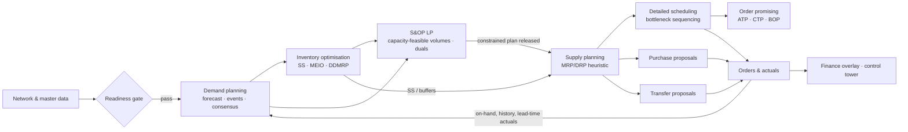

# SCP — Supply Chain Planning for small and mid-sized organisations

**Rebuild blueprint.** This is the one document that decides *what* we build, *in which order*, and *how we prove it is right*.
It replaces the scattered plans in the repo root and `app_v2/` (EXECUTION_PLAN, PRODUCT_BLUEPRINT_V3,
OBSERVABILITY_MAP, GOLDEN_JOURNEY_SPEC, MUST_FIX …). Those stay in git history as reference, but they do not
drive work any more.

Reference sources this blueprint is built against:

- *SAP S/4HANA Supply Chain — End-to-End Guide: Demand to Delivery* (the user's reference guide, §§1–21)
- `app_v2/supply_chain_12_steps (1).html` (12-step framework and its declared gaps)
- `app_v2/Extra recs` and `app_v2/Exploring.docx` (the user's open questions; each one is answered in §9)

---

## 0. Why rebuild and not patch

The legacy app (`*.py` in the repo root, `app_v2/*.jsx`, `index.html`) has real ideas worth keeping. These are
the glass-box LP duals, stress-testing the *committed* plan, and the stale cascade. It cannot be made
industrial-grade by patching, for four structural reasons:

| Defect | Evidence | Consequence |
|---|---|---|
| No canonical data model | Solvers take untyped dicts with fallback chains (`part.get('unit_cost', part.get('landed_cost', 0)) or 0`) | Wrong or missing inputs silently become 0; no solver can say "this input is missing" |
| Units by convention, not by type | `app_v2/UNITS.md` needed a lint to remember that `yield_pct` is a fraction but `hold_pct` is a percent | Every new field is a new chance for a 100× error |
| One company hard-wired | TPAC, 6 SKUs, a 6×6 changeover matrix, `LINE-01` in docs and code | Users cannot model *their* network, which is the product's whole premise |
| No network | Locations, lanes, BOMs and resources are not first-class objects; each solver invents its own slice | Nothing can be visualised end to end; solvers disagree (hence HARNESS-1/1b/provenance gates) |

The S/4 guide says it plainly (§3): *"Roughly 80% of 'the system planned it wrong' incidents are master-data
defects."* So we start where SAP starts: a typed master-data model of the user's own network, then a readiness
gate, then the engines that read it.

**Legacy code stays in place**, untouched, until the new app covers what it did. Nothing new imports from it.
Algorithms worth porting (lot-sizing family, Croston/SBA/TSB, pooling maths, Graves–Willems) are re-implemented
against the new model *with tests*, not copied.

---

## 1. Product scope: what "SAP/IBP/Kinaxis for smaller orgs" means

SAP splits the chain into 12 stations (guide §1.2). A small or mid-sized organisation needs the **planning brain** of
that chain plus just enough **execution feedback** to close the loop. It does not need EWM bin topology or TM
freight tendering.

| S/4 / IBP station (guide §) | SCP module | In scope | Depth target |
|---|---|---|---|
| Master data (§3) | **Network & Master Data** | ✅ core | Full: locations, products, location-products, BOMs, routings, resources, sourcing, lanes, calendars, UoM |
| IBP Demand (§4) | **Demand Planning** | ✅ core | Statistical forecast competition, segmentation, events/promos, NPI like-modelling, consensus overrides, accuracy/bias/FVA |
| Demand mgmt / strategies (§5) | **Planning strategies** | ✅ core | MTS, MTO, planning-with-final-assembly (forecast consumption), ATO (plan components only) |
| IBP Inventory (§4, IO) | **Inventory Optimisation** | ✅ core | Statistical SS (α/β, demand + lead-time variance), MEIO (Graves–Willems GSM), DDMRP buffers, pooling |
| IBP S&OP / pMRP (§4, §8.4) | **S&OP / Constrained Supply** | ✅ core | Time-phased LP over the whole network: capacity, overtime, pre-build, backlog, supplier/lane caps; cost-min *and* profit-max; duals exposed |
| MRP Live (§8) | **Supply Planning (MRP/DRP)** | ✅ core | Low-level-code netting, lot sizing, source determination and quotas, lead-time scheduling, BOM explosion with scrap, firming, exception messages |
| PP/DS (§9) | **Detailed Scheduling** | ✅ phase 5 | Finite sequencing on bottleneck resources, setup matrix by setup group (n×n), campaigns, Gantt |
| aATP (§7) | **Order Promising** | ✅ phase 6 | ATP time series, CTP, product allocation, backorder processing (Win/Gain/Redistribute/Fill/Lose) |
| SD / MM / PP execution (§6, §10, §11) | **Orders & Actuals (execution-lite)** | ✅ phase 7 | Sales orders, POs, production orders, transfers, receipts and issues, so on-hand and actuals come from events |
| EWM (§12) | — | ❌ | Stock is tracked per location, not per bin; shelf life and FEFO handled at planning level |
| TM (§14) | **Logistics** (planning level) | ✅ partial | Multi-mode lanes, transit times, cost per unit/kg/m³/shipment, vehicle-fill; no carrier tendering |
| Billing / ML (§15) | **Finance overlay** | ✅ partial | Inventory value, cost-to-serve, margin by product/customer/channel, capacity-investment NPV from duals |
| Situation handling / KPIs (§17.6, §18.2) | **Control Tower** | ✅ | Exceptions with owner and age, KPI set from §18.2 |

**Design rule from guide §2.2 "Pitfall":** one system of record per decision. Constrained feasibility lives in
S&OP (LP), part-level timing lives in MRP, and sequencing lives in Detailed Scheduling. Each consumes the
previous one read-only. We never answer the same question twice with two engines.

---

## 2. Architecture

```
scp/
  engine/              Python package `scp` — the only place maths lives
    scp/model/         typed master data + transactional data (pydantic v2)
    scp/validate/      readiness gate (master-data checks, codes like SAP exception msgs)
    scp/network/       graph build, low-level codes, echelons, sourcing trees
    scp/time/          calendars, working-day arithmetic, planning buckets
    scp/plan/          MRP/DRP heuristic, lot sizing, safety stock, exceptions, pegging
    scp/optimize/      LP model builder on HiGHS (scipy), S&OP optimizer, duals
    scp/inventory/     statistical SS, GSM MEIO, DDMRP, pooling
    scp/demand/        cleansing, segmentation, forecast models, backtest, events, consumption
    scp/api/           FastAPI app (thin: validate → call engine → return typed result)
    tests/             unit + invariant + golden-scenario tests
  web/                 Vite + React + TypeScript single-page app
  examples/            canonical datasets (JSON), used by tests *and* the UI's "load example"
  docs/                this blueprint + model reference + decision log
```

**Stack decisions and reasons**

- **Python engine + pydantic v2.** The schema *is* the unit contract: a fraction field has `ge=0, le=1`, a
  duration field is named `*_days` and typed `float ≥ 0`. Invalid states cannot be constructed, so the "units lint"
  and the provenance gate become unnecessary.
- **HiGHS via `scipy.optimize.linprog` / `milp`.** An open-source, industrial-strength LP/MIP solver that returns
  duals (marginals) natively. That keeps the "glass-box" wedge: shadow prices on capacity, supplier and lane limits.
- **FastAPI.** Typed request/response models generated from the same pydantic classes, plus an OpenAPI schema. The
  web client's TypeScript types are generated from it, so the UI and engine cannot drift.
- **Vite + React + TypeScript.** A real build replaces in-browser Babel. One design system (§8) replaces the 14
  per-page styles.
- **Persistence (phase 7+).** SQLite via SQLModel for plan versions and actuals. Until then, a *planning dataset* is
  one JSON document (master data + transactional data) that the user can import and export. That is also what
  version snapshots are.

---

## 3. The canonical data model

Conventions that apply to every field, without exception:

| Kind | Rule |
|---|---|
| Quantities | Always in the product's **base UoM**. Alternate UoMs (case, pallet, kg) are conversion factors on the product; the UI converts at the edge. |
| Money | Company currency. Foreign prices carry a currency code and are converted with `settings.fx_rates` at plan time (single conversion site). |
| Rates / shares / yields / service levels | **Fractions** 0–1. The UI displays percent; the API never accepts percent. |
| Durations | `*_days` = calendar days, `*_workdays` = working days of the owning location's calendar, `*_hours` = clock hours. |
| Annual cost rates | `*_rate_per_year` fraction (e.g. carrying rate 0.24). |
| IDs | User-chosen string codes (`PLANT-PUNE`, `SKU-1001`); unique per object type; referenced by ID only. |

### 3.1 Master data (≈ S/4 §3.1 object catalogue)

| SCP object | S/4 analogue | Key fields | What it decides |
|---|---|---|---|
| `Settings` | enterprise structure, FI | currency, planning_start, horizon_days, bucket (day/week/month), fx_rates, wacc, holding_spread, default service level | The world every engine runs in |
| `Calendar` | factory calendar | working weekdays, holidays | Working-day arithmetic for production lead times and capacity |
| `Location` | plant / DC / storage location / BP | type ∈ {plant, dc, warehouse, store, supplier, customer}, calendar, lat/lon, storage capacity (m³), handling cost | The nodes of the network |
| `Product` | material master (MARA) | type ∈ {FG, SFG, RM, PKG}, base UoM, UoM conversions, weight, volume, shelf life, standard cost, family, lifecycle | What flows through the network |
| `LocationProduct` | plant-material (MARC MRP 1–4) | strategy, MRP type, lot sizing, safety stock policy, safety time, on-hand, planning time fence, GR processing time, holding cost, max stock | How *this* product is planned *at this* location; the single most important object |
| `Resource` | work center / resource | location, kind ∈ {machine, labor, line, tool}, parallel units, shifts/day, hours/shift, efficiency (OEE), overtime cap and cost, cost/hour, finite flag, setup group matrix | Capacity supply |
| `ProductionSource` | production version = BOM + routing | output product and location, components (qty per, component scrap, consuming operation), operations (resource, setup hours, run hours/unit, labor resource and labor hours/unit), assembly scrap, lot range, validity, quota | How to make something, and what that consumes |
| `PurchasingSource` | info record + source list + quota | supplier, product, receiving location, price and currency, MOQ, rounding, planned delivery time (+σ), supplier capacity/week, duty rate, quota/priority, validity | How to buy something and at what landed cost |
| `TransportLane` | transportation lane + means of transport | origin, destination, product scope, modes (transit days ±σ, cost per unit/kg/m³/shipment, vehicle capacity, lane capacity/week), quota/priority | How goods move between two locations |

A **customer** is a `Location` of type `customer`. Customer demand is fulfilled through a lane from a DC or plant,
so the customer is the leaf of the network graph and not a special case. A **supplier** is a `Location` of type
`supplier`. What it sells is a `PurchasingSource`, and how the goods travel is an optional `TransportLane`: if
there is none, freight is taken as included in the price (DDP-like incoterm).

### 3.2 Transactional data

| Object | S/4 analogue | Notes |
|---|---|---|
| `DemandRecord` (kind=forecast) | PIR (PBIM/PBED) | Released consensus forecast per location-product-date |
| `DemandRecord` (kind=sales_order) | sales order schedule line (VBBE) | Firm customer demand with priority. Consumes forecast per the strategy (§5.4 of guide) |
| `ScheduledReceipt` | PO / production order / STO | Firm supply already in the pipeline; never moved by MRP (§8.1 "firmed receipts") |
| `SalesHistory` | billing history | Long format: date, location, product, qty, price, promo flag, plus optional exogenous columns |
| on-hand | MATDOC projection | `LocationProduct.on_hand` in v1; derived from goods movements from phase 7 |

### 3.3 Plan outputs (a *plan version*)

`PlannedOrder` (make / buy / transfer, with dates, source and pegging), `DependentRequirement`, a per-node time
series (the MD04 equivalent: gross requirements, receipts, projected on-hand, safety stock, shortage), a
per-resource load against capacity, `Exception` messages, and KPIs. Every number carries its derivation, so the UI
can answer "why is this order here?" by walking the pegging tree.

---

## 4. The end-to-end planning flow



The hand-offs are the product. Each arrow is a typed object with an owner, a version and a staleness hash (the
legacy "STALE cascade" done properly: a plan version stores the hash of every input it read).

### 4.1 How the MRP/DRP engine works (guide §8, applied to a network)

Every **(location, product)** pair is a planning node. Nodes are processed in **low-level-code order** across the
whole network. The code is the longest path from any demand leaf, counting both BOM edges and transport edges, so
that every requirement a node receives exists before the node is planned. For each node, walking forward through
the buckets:

1. **Net requirements:** `avail(t) = avail(t−1) + receipts(t) − requirements(t)`. There is a shortage when
   `avail(t) < SS(t)`, and the shortage quantity is `SS(t) − avail(t)` (guide §8.1).
2. **Lot sizing:** L4L, fixed, EOQ, periodic (POQ), min/max (replenish to max), then MOQ, rounding and max-lot
   splitting (guide §8.3).
3. **Source determination:** production sources, purchasing sources and inbound lanes valid on that date, split by
   quota or ranked by priority (guide §11 source list and quota).
4. **Scheduling:** backward from the need date by lead time. That is transit days for transfers; planned delivery
   time + GR processing for purchases; working days from the routing for production. If the start date is before
   today, reschedule forward and raise *start in past* (guide §8.1, SAP 06/07).
5. **Explosion:** production orders create dependent requirements for components (`qty × qty_per ÷
   (1 − assembly scrap) ÷ (1 − component scrap)`, both scraps are fractions of input lost) and load resources (setup + run hours). Transfers create
   requirements at the origin node. Purchases load supplier capacity.
6. **Exceptions:** below safety stock, start in past, no valid source, capacity overload, supplier or lane
   capacity exceeded, excess stock, shelf-life risk (cover exceeds shelf life).

Planning time fence and firming (guide §8.5): inside `planning_time_fence_days`, MRP does not create new orders.
New proposals are pushed to the fence end and a *late* exception is raised. This is firming type 1, the sensible
default.

### 4.2 Planning strategies (guide §5.2), mapped

| SCP strategy | SAP strategy | Forecast | Sales orders | Stock |
|---|---|---|---|---|
| `MTS` | 10 | drives supply | not consumed against forecast; reduce stock | anonymous |
| `MTS_CONSUME` (default) | 40 | drives supply | consume forecast within ±consumption window; excess orders add demand | anonymous |
| `MTO` | 20 | none | each order drives its own supply | order-specific (pegged) |
| `ATO` | 50 / 74 | plans components only (FG orders non-convertible) | trigger final assembly | components anonymous |

Guide §5.4 decision rule, surfaced in the UI as a recommendation: `CDT` (customer-accepted delivery time) against
`CLT` (component lead time) + `ALT` (assembly lead time) decides MTO vs ATO vs MTS per product family.

---

## 5. Inventory policy: where safety stock comes from

Safety stock is a **policy on `LocationProduct`**, chosen by method:

| Method | Formula | Use when |
|---|---|---|
| `fixed` | SS = qty | Contractual or minimum presentation stock |
| `days_of_supply` | SS(t) = avg daily demand over next *n* days × *n* (coverage profile, "breathes" with demand) | Planner-friendly default for B/C items |
| `service_level` (cycle service level, α) | SS = z(α) · √((L+R)·σ_d² + d̄²·σ_L²) | Normally distributed demand, uncertain lead time |
| `fill_rate` (β) | Find k with σ_LT·G(k) = (1−β)·Q, SS = k·σ_LT | When the order quantity matters (large lots) |
| `meio` | Graves–Willems GSM service times over the network | Multi-echelon placement: buffer where it is cheapest to hold |
| `ddmrp` | red/yellow/green zones from ADU × DLT × lead-time and variability factors | High-variability decoupled positions |

The inputs (σ_d, σ_L) come from Demand Planning (forecast error, not raw demand variance) and from actual lead-time
history once execution data exists. That answers the legacy question "is yield/SS just assumed?". It is a
*parameter until data exists*, then *measured*.

Guide pitfall honoured: safety stock **and** safety time on the same node is flagged as double buffering by the
readiness gate.

---

## 6. S&OP / constrained supply LP (the IBP optimizer analogue)

A time-phased network-flow LP over the same master data:

- **Variables:** production per source per bucket, overtime hours per resource per bucket, purchases per
  source per bucket, transfers per lane-mode per bucket, inventory per node per bucket, backlog/unmet demand per
  demand node per bucket, safety-stock shortfall.
- **Constraints:** flow balance per node per bucket with lead-time offsets; resource hours ≤ regular + overtime;
  overtime ≤ cap; supplier capacity; lane capacity; storage capacity per location; shelf life (inventory ≤ demand
  over the next shelf-life window).
- **Objective, cost mode:** purchase + conversion + resource + overtime + transport + holding (carrying rate ×
  value) + backlog penalty (by priority) + SS-shortfall penalty.
- **Objective, profit mode:** revenue − all costs, with demand as an upper bound. This **subsumes the legacy
  "profit mix" LP**: for one product and one resource it reduces exactly to margin-per-bottleneck-hour ranking. The
  dual on each resource is the value of one more hour. That value feeds the capacity-investment NPV in Finance, so
  the identity the 12-step guide asks for holds by construction, because it is *one* model.
- **Level vs chase** is not a separate solver. It is what the LP chooses given hire/overtime/holding/backlog costs.
  Workforce levels are a `labor` resource whose capacity can vary per bucket, with hire/fire costs as optional
  variables.

The guide §4 pitfall ("releasing unconstrained consensus into MRP ignores capacity") is solved by the release
step: S&OP writes the constrained volumes as the demand MRP plans against, and the unconstrained forecast stays
visible for gap analysis.

---

## 7. Verification strategy (replaces provenance, HARNESS-1, HARNESS-1b and golden_path)

The four legacy gates exist because the architecture let solvers disagree. The new layers:

1. **Types:** pydantic models make out-of-range and mis-unit inputs unconstructable. There is no units lint.
2. **Readiness gate:** `scp.validate` runs coded checks, mirroring guide §3 "master data readiness gate". Examples:
   production source without components or operations, BOM cycle, lane to an unknown location, demand at a node
   with no source path, SS and safety time both set, purchasing source with zero lead time, missing weight when a
   lane is costed per kg. Errors block planning; warnings do not.
3. **Engine invariants, asserted in tests *and* checked at run time:**
   - material balance per node per bucket: `on_hand₀ + Σreceipts − Σrequirements = projected_on_hand_T`
   - pegging completeness: every planned order's quantity is pegged to requirements (plus explicit lot-size excess)
   - resource load = Σ(orders × (setup + run × qty)) per bucket
   - LP: primal feasible, and duals match a finite-difference re-solve (the legacy "Prove it", automated)
4. **Golden scenarios:** textbook cases with hand-computed answers. Examples are a Heizer/Render MRP example,
   EOQ/POQ lot sizing, the Graves–Willems (2000) worked example, and a two-echelon DRP.
5. **Scenario regression (guide §20.1):** the S/4 test list becomes our end-to-end suite. Forecast → plan →
   stock with quantities surviving every hand-off; MTO order; ATO; multi-plant transfer; capacity-constrained
   S&OP.
6. **UI end-to-end tests (Playwright)** on the golden path, in CI (GitHub Actions) on every push.

---

## 8. Product design rules

1. **The network is home.** The first screen is the user's own network map (suppliers → plants → DCs →
   customers), with health badges from the readiness gate and the last plan.
2. **One object pattern everywhere.** A list and a detail panel. Each master-data object has exactly one editor.
   There are no read-only duplicates of inputs on other pages; other pages *link* to the editor.
3. **One field component.** Label, unit suffix, fraction-as-percent display, inline validation from the same
   schema, and a "where is this used" link. All of this is generated from the pydantic schema, so no page can
   invent its own input style.
4. **Progressive disclosure.** NPI, promotions and events are *actions* ("+ Add promotion", "+ New product
   launch") that open a flow. They are not permanent panels.
5. **Always say which object you are editing.** The context bar shows `Location › Product` (or
   `Source › Operation`) on every editor, so a user never confuses part A with part B.
6. **Real dates.** Buckets show calendar dates respecting the chosen granularity (day, week or month), with
   drill-down month → week → day where the data exists.
7. **Every number explains itself.** Click a planned order to get its pegging tree, lead-time build-up and lot-size
   rule. Click a shadow price to get the binding constraint and its valid range.

---

## 9. The user's open questions, answered by design

| Question (from `Extra recs`, `Exploring.docx`) | Answer in the new model |
|---|---|
| "High-value runner", weights, "tail SKU / EVA destroyer": how are labels decided and do they have impact? | Labels are **derived, never typed**: ABC by revenue or contribution share (80/15/5), XYZ by forecast-error CV, demand pattern by ADI/CV² (smooth/erratic/intermittent/lumpy). They *drive defaults*: service level target per ABC-XYZ cell, forecast model family (Croston for intermittent), SS method, review frequency. "Value destroyer" = negative contribution after the carrying cost of its inventory; shown by the finance overlay, not as a label typed by hand. |
| "Line shared with this SKU": how does a user define it? | They don't write it anywhere. Two production sources whose operations use the same `Resource` *are* sharing it. The network view shows it as a derived relationship. |
| Parts master per SKU, shelf life, storage: are they separate per product? | BOM = `ProductionSource.components` per output product and location. Shelf life lives on `Product` (override on `LocationProduct`). Storage capacity lives on `Location`, consumed via product volume. Nothing is shared by accident because every attribute has exactly one owner object. |
| Not all parts are imported; tariffs; is landed cost the ordering cost? | Import is a property of the `PurchasingSource` (supplier location, currency, duty rate), not of the part. **Landed cost** = price × FX × (1 + duty) + freight (lane) + handling. It is the *unit cost* used for valuation and holding cost. **Ordering cost** is different: the fixed cost per order (admin, inspection, fixed freight per shipment), used for lot sizing (EOQ). Both are explicit fields. |
| Where do I enter demand? MTO vs MTS? No history / new product? | Demand history is uploaded in long format (`date, location, product, qty[, price, promo, …]`) or entered on a date grid. Strategy per location-product decides the treatment (§4.2). MTO orders are `DemandRecord(kind=sales_order)`. No history → NPI flow: pick a like-product and scale, or use a launch curve. |
| Promotions: when do I enter them and does the forecast update? | Events are objects (promo, price change, launch, competitor entry, store opening) with a date range and either a known lift or a causal flag for regression models. Adding an event re-runs only that product's forecast, and the plan version becomes *stale* until re-planned. |
| Where do actuals go? Day/week/month? | Actuals are events (sales, receipts, issues) in phase 7. Until then, history upload. Bucket granularity is a plan setting with real calendar dates. |
| One product only: is profit mix needed? | No separate profit mix exists. The S&OP LP in profit mode handles 1..n products, and with one product it just answers "is it worth making, and how much overtime pays for itself". |
| Machine hours vs worker hours, lines and stages? | An operation (stage) consumes a machine `Resource` (setup + run hours) and optionally a labor `Resource` (labor hours per unit). The bottleneck is whichever resource's load/capacity is highest; the LP dual says which constraint binds. |
| Overtime per hour or per shift? | `Resource.overtime_cost_per_hour` plus optional `overtime_block_hours` (e.g. 8 = whole-shift OT). A shift block makes it a MIP in S&OP, used only when the block is set. |
| Yield, scrap, rework: how do big orgs configure it? | Exactly as SAP (§8.3 modifiers): **assembly scrap** on the production source (output loss), **component scrap** per BOM line (that component's loss), and operation yield per operation. MRP inflates requirements by them. Actual yields from phase 7 replace the parameters, and the gap is reported. SS covers *variability*; scrap covers *expected* loss. They are not substitutes. |
| On-hand, scheduled receipts, per location? | `LocationProduct.on_hand` per location, and `ScheduledReceipt` per location-product with a due date. |
| Transport inbound/outbound, units? | `TransportLane` with per-mode transit and costs per unit/kg/m³/shipment. Inbound = supplier→plant lanes, outbound = plant→DC→customer lanes. Weight and volume come from `Product`, so the units are unambiguous. |
| Is carrying cost the hurdle rate? Build-ahead? | Carrying rate = WACC + holding spread (storage, insurance, obsolescence), annual fraction. It prices *all* inventory in the LP, so build-ahead happens only when overtime or backlog costs exceed carrying cost. That is the level-vs-chase trade-off, decided by the LP. |
| 16 forecast methods but only Holt-Winters + RF shown? | Every model produces its own forecast and backtest. The competition picks per product by out-of-sample error (MASE and WAPE), and the UI shows the full leaderboard, bias and forecast value add vs naïve. |
| 6×6 changeover matrix because 6 SKUs? | No. Setup is by **setup group**, n×n over groups (colour, allergen, diameter). Products map to groups, which scales to any number of SKUs. |
| When should stages be defined, and do they consume parts at different times? | Operations are the stages. A BOM line can name the operation that consumes it, so the component is required at that operation's start (lead-time offset), not at order start. |
| Are provenance + H1 + H1b the best verification? | No. See §7: types, readiness gate, invariants, golden scenarios and e2e tests, all in CI. |
| Multi-location complexity? | Native. Every object is location-scoped from day one, and single-location is just a network with one plant. |

---

## 10. Phased delivery (each phase ends green in CI with the tests named)

| Phase | Deliverable | Exit criteria |
|---|---|---|
| **P0 Foundation** | Typed model, calendars and buckets, readiness gate, network graph and low-level codes, three example datasets, API, web shell with network map and master-data editors | Schema round-trip tests; every readiness rule has a positive and a negative test; examples validate clean |
| **P1 Supply planning** | MRP/DRP heuristic, lot sizing, statistical SS, firming, exceptions, pegging, capacity load; MD04-style node view; capacity view | Invariants hold on all examples and on random networks; golden MRP example matches textbook |
| **P2 Demand planning** | History ingest and cleansing, segmentation, model competition and backtest, events, NPI, consensus overrides, forecast consumption, release | Backtest metrics against known series; consumption tests for each strategy |
| **P3 Inventory optimisation** | α/β SS with lead-time variance, GSM MEIO, DDMRP, pooling analysis, policy push with approval | GSM matches Graves–Willems worked example and brute-force on small trees |
| **P4 S&OP LP** | Constrained plan, cost and profit modes, duals and ranges, scenario compare, release to MRP | Duals equal finite-difference re-solve; single-product reduces to margin/hour ranking |
| **P5 Detailed scheduling** | Bottleneck sequencing with setup groups, campaigns, Gantt | Schedule feasibility checker; weighted objective (tardiness + changeover) ≤ EDD baseline |
| **P6 Order promising** | ATP/CTP, allocation, BOP | Guide §20.1 scenarios 2–5 |
| **P7 Orders & actuals** | Firm orders, goods movements, on-hand from events, accuracy loop, SQLite persistence | Stock = Σ movements; forecast accuracy report |
| **P8 Versions & scenarios** | Server-side branches of plan versions, compare, promote | Base version byte-identical after branch discard |
| **P9 Finance overlay** | Inventory value, cost-to-serve, margin, capacity NPV from duals | Reconciles to plan costs exactly |
| **P10 Control tower** | Exception worklists with owner and age, KPI set from guide §18.2 | KPI definitions tested against fixtures |

**Delivered:** P0 and P1, then P2 (demand planning, with Google TimesFM as an optional candidate model; see
[TIMESFM.md](TIMESFM.md)), then P3 (inventory optimisation: single-echelon baseline, guaranteed-service MEIO as an
exact MILP, DDMRP, pooling, approve-to-apply policies), then P4 (S&OP LP with duals and ranges on HiGHS, cost and
profit modes, scenario levers and compare, release to MRP), then P5 (detailed scheduling: shift-window clock time,
sequence-dependent changeover matrix, sublots over parallel units, EDD baseline plus campaign and insertion local
search, independent feasibility checker, manual resequencing, labour load check, planning-board Gantt), then P6
(order promising: cumulative ATP, delivery rules, total RLT, allocations, alternative locations, multi-level CTP,
persisted confirmations, BOP with the five strategies, all four §20.1 promising scenarios as tests). The web client adopts the legacy app's design language: Mono / Noir / Sepia themes,
numbered stages, the planning-spine freshness strip, and provenance / reading / solver-IO boxes.
